# 4, Experiment on K=10, P=20


```python
import pandas as pd
import numpy as np
import matplotlib.pyplot as plt
import scipy
from scipy.io import loadmat
import math
```


```python
X = loadmat("mnist.mat")
data_train = X['trainX'] # Training set digits 

```


```python
def initiation(K,data):
 
    n = int(len(data)/K)
    
    cluster_num = np.repeat(np.arange(K),n)
    np.random.shuffle(cluster_num)
    return cluster_num
```


```python
def get_label(cluster_num,K,data):
    label = np.zeros((K,len(data[0])))
    for i in range(K):
        cluster = data[np.where(cluster_num==i)]
        label[i,:] = np.mean(cluster,axis = 0)
    return label # return a list of label
```


```python
def new_cluster(K,label,data):
    # new_cluster_num = old_cluster
    data_norms = np.zeros((len(data),K)) 
    
    for i in range(K):
        dists = np.linalg.norm(data-label[i], axis = 1)
        data_norms[:,i] = dists
        
    new_cluster_num = np.argmin(data_norms, axis = 1)
    
    return new_cluster_num
```


```python
def k_mean(K,data):
    cluster_num = initiation(K,data)
    label = get_label(cluster_num,K,data)
    count = 0
    J_clust = []
    while count<25:
        cluster_num = new_cluster(K,label,data)
        label = get_label(cluster_num,K,data)
        count += 1
        
        print('%d th iteration' % count) 
        
        means = np.linalg.norm(data-label[cluster_num])
        J = np.sum(means)

        J = J/len(data)
        J_clust.append(J)
    return cluster_num, label, J_clust
```


```python
def k_mean_Pruns(K,data,P):
    J_clust_all = np.zeros((P,25))
    label_all = np.zeros((P,K,len(data[0])))
    cluster_all = np.zeros((P,len(data)))
    for i in range(P):
        cluster_num, label, J_clust = k_mean(K,data)
        J_clust_all[i,:] = J_clust
        label_all[i,:,:] = label
        cluster_all[i,:] = cluster_num
    min_J_i = np.argmin(J_clust_all[:,-1])
    max_J_i = np.argmax(J_clust_all[:,-1])
    min_J = J_clust_all[min_J_i]
    max_J = J_clust_all[max_J_i]
    min_label = label_all[min_J_i]
    max_label = label_all[max_J_i]
    min_cluster = cluster_all[min_J_i]
    max_cluster = cluster_all[max_J_i]
    return min_J, min_label, min_cluster, max_J, max_label, max_cluster
```


```python
min_J, min_label, min_cluster, max_J, max_label, max_cluster = k_mean_Pruns(10,data_train,20)
```

## 4.1 Plotting J_clust


```python
x = np.arange(25)+1
plt.plot(x, min_J)
plt.plot(x, max_J)
plt.title('J_clust for K=10, P=20')
plt.xlabel('Iteration')
plt.ylabel('J_clust')
```


    Text(0, 0.5, 'J_clust')


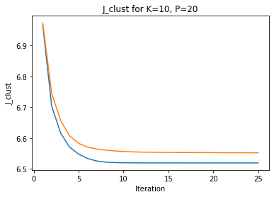


The minimum(blue) and maximum(orange) J_clust shows similar curve. They both drop very quickly before the first 5 iteration and flatten out at about 10 iterations. This suggests that the clustering is successful. Before 2 iterations, the two curves overlap a lot, but after that the minimum J_clust flattens out at a smaller value than the maximum J_clust. The curve shape is very similar to that of K=20, P=30, but has a larger J_clust value after the last iteration. This make sense since more classes and more repeated times are supposed to generate more accurate classification, which is showed in smaller J_clust.

## 4.2 Visualization of representitives


```python
fig, axs = plt.subplots(2, 5)
(ax1, ax2, ax3, ax4, ax5), (ax6, ax7, ax8, ax9, ax10) = axs
fig.suptitle('Visualization for smallest J_clust for K=10,P=20')
ax1.imshow(min_label[0,:].reshape(28,28),cmap='binary')
ax2.imshow(min_label[1,:].reshape(28,28),cmap='binary')
ax3.imshow(min_label[2,:].reshape(28,28),cmap='binary')
ax4.imshow(min_label[3,:].reshape(28,28),cmap='binary')
ax5.imshow(min_label[4,:].reshape(28,28),cmap='binary')
ax6.imshow(min_label[5,:].reshape(28,28),cmap='binary')
ax7.imshow(min_label[6,:].reshape(28,28),cmap='binary')
ax8.imshow(min_label[7,:].reshape(28,28),cmap='binary')
ax9.imshow(min_label[8,:].reshape(28,28),cmap='binary')
ax10.imshow(min_label[9,:].reshape(28,28),cmap='binary')

for ax in axs.flat:
    ax.label_outer()
```


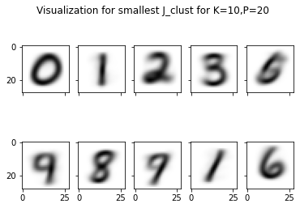


The representitives should be digits that represent all digits in that class. For minimum J_clust, they represents digits 0,1,2,3,5,9,8,7,1,6.


```python
fig, axs = plt.subplots(2, 5)
(ax1, ax2, ax3, ax4, ax5), (ax6, ax7, ax8, ax9, ax10) = axs
fig.suptitle('Visualization for largestest J_clust for K=10,P=20')
ax1.imshow(max_label[0,:].reshape(28,28),cmap='binary')
ax2.imshow(max_label[1,:].reshape(28,28),cmap='binary')
ax3.imshow(max_label[2,:].reshape(28,28),cmap='binary')
ax4.imshow(max_label[3,:].reshape(28,28),cmap='binary')
ax5.imshow(max_label[4,:].reshape(28,28),cmap='binary')
ax6.imshow(max_label[5,:].reshape(28,28),cmap='binary')
ax7.imshow(max_label[6,:].reshape(28,28),cmap='binary')
ax8.imshow(max_label[7,:].reshape(28,28),cmap='binary')
ax9.imshow(max_label[8,:].reshape(28,28),cmap='binary')
ax10.imshow(max_label[9,:].reshape(28,28),cmap='binary')

for ax in axs.flat:
    ax.label_outer()
```


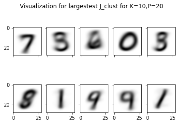


For maximum J_clust, they represents digits 7,3,6,0,3,8,1,9/4,9,1. Representitives for minimum J_clust shows clearer identification of digits than Representitives for maximum J_clust. Some of the representitives in maximum J_clust. such as class 2 in 1st row 3th column, shows very blury image which are hard to identified which digit it represents, while representitives in minimum J_clust are earsier to identified as digits. Also, representitives for maximum J_clust of class 8 represents two digits, 4 and 9, and there're two represents 3 but none representes 5. Each representitive for minimum J_clust represents 1 digit with no repetition or missing. Thus, min_clust gives better representitives.

Comparing to K=20, P=30, each representitives shows blurier images and is harder to identify as digit.

## 4.3 Identification of Classified/Misclassified


```python
def find_10smallest(data,cluster,label,num):
    data_atnum = data[np.where(cluster == num)]
    dists = np.linalg.norm(data_atnum-label[num], axis = 1)
    smallest_i = np.argpartition(dists,10)[:10]
    smallest_data = data_atnum[smallest_i]
    return smallest_data
```


```python
def draw_10smallest(data,cluster,label,num):
    smallest10_data = find_10smallest(data,cluster,label,num)
    fig, axs = plt.subplots(2, 5)
    (ax1, ax2, ax3, ax4, ax5), (ax6, ax7, ax8, ax9, ax10) = axs
    fig.suptitle('Visualization for smallest 10 for class %d' % num)
    ax1.imshow(smallest10_data[0,:].reshape(28,28),cmap='binary')
    ax2.imshow(smallest10_data[1,:].reshape(28,28),cmap='binary')
    ax3.imshow(smallest10_data[2,:].reshape(28,28),cmap='binary')
    ax4.imshow(smallest10_data[3,:].reshape(28,28),cmap='binary')
    ax5.imshow(smallest10_data[4,:].reshape(28,28),cmap='binary')
    ax6.imshow(smallest10_data[5,:].reshape(28,28),cmap='binary')
    ax7.imshow(smallest10_data[6,:].reshape(28,28),cmap='binary')
    ax8.imshow(smallest10_data[7,:].reshape(28,28),cmap='binary')
    ax9.imshow(smallest10_data[8,:].reshape(28,28),cmap='binary')
    ax10.imshow(smallest10_data[9,:].reshape(28,28),cmap='binary')

    for ax in axs.flat:
        ax.label_outer()
```

### 4.3.1 Identification for minimum J_clust


```python
draw_10smallest(data_train,min_cluster,min_label,0)
```


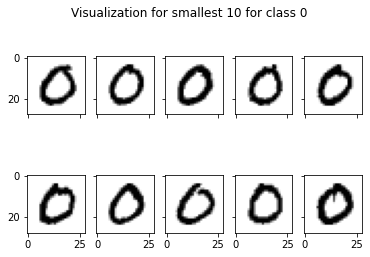


We can see that class 0 represents number 0.   
Digits: 0,0,0,0,0,0,0,0,0,0  
Number of classified: 10  
Number of misclassified: 0 


```python
draw_10smallest(data_train,min_cluster,min_label,1)
```


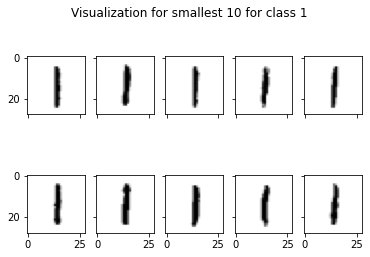


We can see that class 1 represents number 1.  
Digits: 1,1,1,1,1,1,1,1,1,1  
Number of classified: 10  
Number of misclassified: 0  


```python
draw_10smallest(data_train,min_cluster,min_label,2)
```


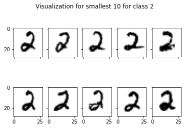


We can see that class 2 represents number 2.  
Digits: 2,2,2,2,2,2,2,2,2,2  
Number of classified: 10  
Number of misclassified: 0  


```python
draw_10smallest(data_train,min_cluster,min_label,3)
```


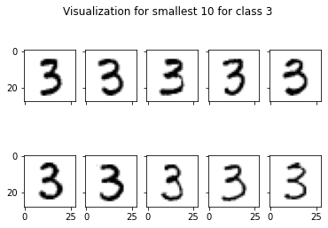


We can see that class 3 represents number 3.  
Digits: 3,3,3,3,3,3,3,3,3,3  
Number of classified: 10  
Number of misclassified: 0 


```python
draw_10smallest(data_train,min_cluster,min_label,4)
```


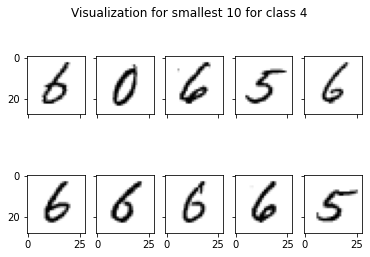


We can see that class 4 represents number 5.  
Digits: 6,0,6,5,6,6,6,6,6,5  
Number of classified: 2  
Number of misclassified: 8 


```python
draw_10smallest(data_train,min_cluster,min_label,5)
```


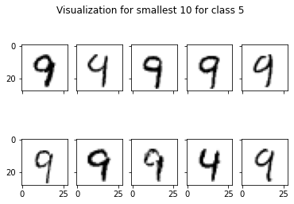


We can see that class 5 represents number 9.  
Digits: 9,9,9,9,9,9,9,9,4,9  
Number of classified: 9  
Number of misclassified: 1  


```python
draw_10smallest(data_train,min_cluster,min_label,6)
```


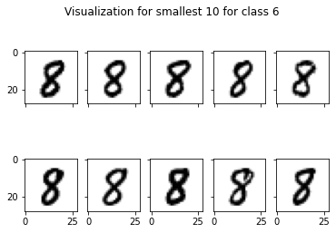


We can see that class 6 represents number 8.  
Digits: 8,8,8,8,8,8,8,8,8,8  
Number of classified: 10  
Number of misclassified: 0 


```python
draw_10smallest(data_train,min_cluster,min_label,7)
```


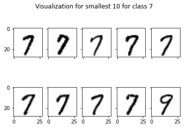


We can see that class 7 represents number 7.  
Digits: 7,7,7,7,7,7,7,7,7,9  
Number of classified: 9  
Number of misclassified: 1 


```python
draw_10smallest(data_train,min_cluster,min_label,8)
```


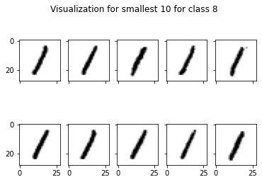


We can see that class 8 represents number 1.  
Digits: 1,1,1,1,1,1,1,1,1,1  
Number of classified: 10  
Number of misclassified: 0 


```python
draw_10smallest(data_train,min_cluster,min_label,9)
```


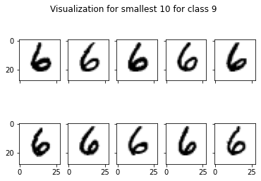


We can see that class 9 represents number 6.  
Digits: 6,6,6,6,6,6,6,6,6,6  
Number of classified: 10  
Number of misclassified: 0 

### 4.3.2 Identification for maximum J_clust


```python
draw_10smallest(data_train,max_cluster,max_label,0)
```


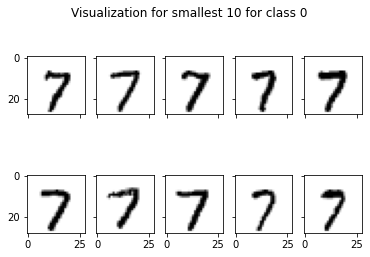


We can see that class 0 represents number 7.  
Digits: 7,7,7,7,7,7,7,7,7,7  
Number of classified: 10  
Number of misclassified: 0


```python
draw_10smallest(data_train,max_cluster,max_label,1)
```


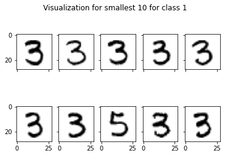


We can see that class 1 represents number 3.  
Digits: 3,3,3,3,3,3,3,5,3,3  
Number of classified: 9  
Number of misclassified: 1


```python
draw_10smallest(data_train,max_cluster,max_label,2)
```


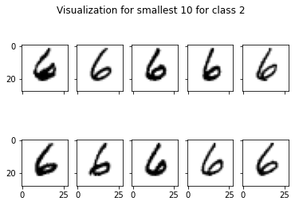


We can see that class 2 represents number 6.  
Digits: 6,6,6,6,6,6,6,6,6,6  
Number of classified: 10  
Number of misclassified: 0


```python
draw_10smallest(data_train,max_cluster,max_label,3)
```


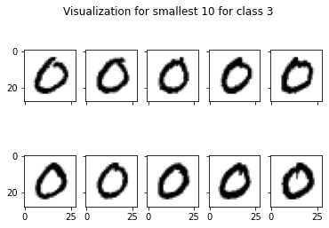


We can see that class 3 represents number 0.  
Digits: 0,0,0,0,0,0,0,0,0,0  
Number of classified: 10  
Number of misclassified: 0


```python
draw_10smallest(data_train,max_cluster,max_label,4)
```


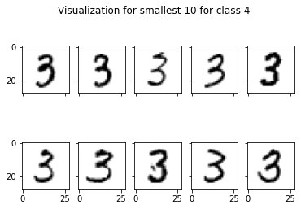


We can see that class 4 represents number 3.  
Digits: 3,3,3,3,3,3,3,3,3,3  
Number of classified: 10  
Number of misclassified: 0


```python
draw_10smallest(data_train,max_cluster,max_label,5)
```


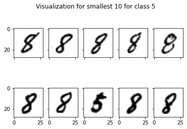


We can see that class 5 represents number 8.  
Digits: 8,8,8,8,8,8,8,5,8,8  
Number of classified: 9  
Number of misclassified: 1


```python
draw_10smallest(data_train,max_cluster,max_label,6)
```


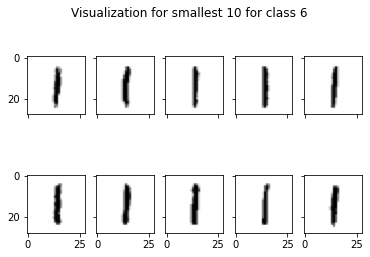


We can see that class 6 represents number 1.  
Digits: 1,1,1,1,1,1,1,1,1,1  
Number of classified: 10  
Number of misclassified: 0


```python
draw_10smallest(data_train,max_cluster,max_label,7)
```


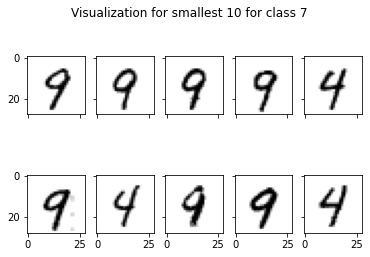


We can see that class 7 represents number 9 and 4.  
Digits: 9,9,9,9,4,9,4,9,9,4  
Number of classified: 10  
Number of misclassified: 0


```python
draw_10smallest(data_train,max_cluster,max_label,8)
```


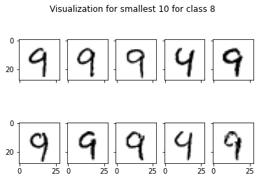


We can see that class 8 represents number 9.  
Digits: 9,9,9,4,9,9,9,9,4,9  
Number of classified: 8  
Number of misclassified: 2


```python
draw_10smallest(data_train,max_cluster,max_label,9)
```


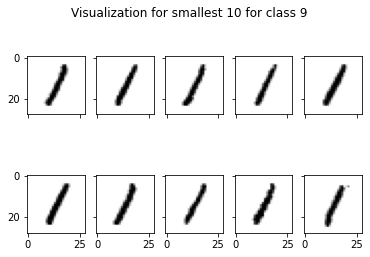


We can see that class 9 represents number 1.  
Digits: 1,1,1,1,1,1,1,1,1,1  
Number of classified: 10  
Number of misclassified: 0

### 4.3.3 Tables of classified/misclassified

Following is the table for minimum J_clust.


```python
min_identify = {'Classified': [10,10,10,10,2,9,10,9,10,10],
        'Misclassified': [0,0,0,0,8,1,0,1,0,0] }
table_min = pd.DataFrame(min_identify, columns = ['Classified', 'Misclassified'])
table_min
```


<div>
<style scoped>
    .dataframe tbody tr th:only-of-type {
        vertical-align: middle;
    }

    .dataframe tbody tr th {
        vertical-align: top;
    }

    .dataframe thead th {
        text-align: right;
    }
</style>
<table border="1" class="dataframe">
  <thead>
    <tr style="text-align: right;">
      <th></th>
      <th>Classified</th>
      <th>Misclassified</th>
    </tr>
  </thead>
  <tbody>
    <tr>
      <th>0</th>
      <td>10</td>
      <td>0</td>
    </tr>
    <tr>
      <th>1</th>
      <td>10</td>
      <td>0</td>
    </tr>
    <tr>
      <th>2</th>
      <td>10</td>
      <td>0</td>
    </tr>
    <tr>
      <th>3</th>
      <td>10</td>
      <td>0</td>
    </tr>
    <tr>
      <th>4</th>
      <td>2</td>
      <td>8</td>
    </tr>
    <tr>
      <th>5</th>
      <td>9</td>
      <td>1</td>
    </tr>
    <tr>
      <th>6</th>
      <td>10</td>
      <td>0</td>
    </tr>
    <tr>
      <th>7</th>
      <td>9</td>
      <td>1</td>
    </tr>
    <tr>
      <th>8</th>
      <td>10</td>
      <td>0</td>
    </tr>
    <tr>
      <th>9</th>
      <td>10</td>
      <td>0</td>
    </tr>
  </tbody>
</table>
</div>


Following is the table for maximum J_clust.


```python
max_identify = {'Classified': [10,9,10,10,10,9,10,10,8,10],
        'Misclassified': [0,1,0,0,0,1,0,0,2,0] }
table_max = pd.DataFrame(max_identify, columns = ['Classified', 'Misclassified'])
table_max
```


<div>
<style scoped>
    .dataframe tbody tr th:only-of-type {
        vertical-align: middle;
    }

    .dataframe tbody tr th {
        vertical-align: top;
    }

    .dataframe thead th {
        text-align: right;
    }
</style>
<table border="1" class="dataframe">
  <thead>
    <tr style="text-align: right;">
      <th></th>
      <th>Classified</th>
      <th>Misclassified</th>
    </tr>
  </thead>
  <tbody>
    <tr>
      <th>0</th>
      <td>10</td>
      <td>0</td>
    </tr>
    <tr>
      <th>1</th>
      <td>9</td>
      <td>1</td>
    </tr>
    <tr>
      <th>2</th>
      <td>10</td>
      <td>0</td>
    </tr>
    <tr>
      <th>3</th>
      <td>10</td>
      <td>0</td>
    </tr>
    <tr>
      <th>4</th>
      <td>10</td>
      <td>0</td>
    </tr>
    <tr>
      <th>5</th>
      <td>9</td>
      <td>1</td>
    </tr>
    <tr>
      <th>6</th>
      <td>10</td>
      <td>0</td>
    </tr>
    <tr>
      <th>7</th>
      <td>10</td>
      <td>0</td>
    </tr>
    <tr>
      <th>8</th>
      <td>8</td>
      <td>2</td>
    </tr>
    <tr>
      <th>9</th>
      <td>10</td>
      <td>0</td>
    </tr>
  </tbody>
</table>
</div>


Observation shows that maximum J_clust has a similar number of misclassified to minimum J_clust, except minimum J_clust has 8 misclassified in class 4. As J_clust represents distance from each data to the representitives, smaller J_clust means better classification of each digit. Thus class 4 is likely an outlier. 

### 4.3.4 Example visualization of misclassifed and classified in some class

#### Minimum J_clust


```python
plt.subplot()
plt.imshow(min_label[1,:].reshape(28,28),cmap='binary')
plt.title('Representitive')

data_atnum = data_train[np.where(min_cluster == 1)]

fig, axs = plt.subplots(2, 5)
(ax1, ax2, ax3, ax4, ax5), (ax6, ax7, ax8, ax9, ax10) = axs
fig.suptitle('Classification examples in this class')
ax1.imshow(data_atnum[0,:].reshape(28,28),cmap='binary')
ax2.imshow(data_atnum[1,:].reshape(28,28),cmap='binary')
ax3.imshow(data_atnum[2,:].reshape(28,28),cmap='binary')
ax4.imshow(data_atnum[3,:].reshape(28,28),cmap='binary')
ax5.imshow(data_atnum[4,:].reshape(28,28),cmap='binary')
ax6.imshow(data_atnum[5,:].reshape(28,28),cmap='binary')
ax7.imshow(data_atnum[6,:].reshape(28,28),cmap='binary')
ax8.imshow(data_atnum[7,:].reshape(28,28),cmap='binary')
ax9.imshow(data_atnum[8,:].reshape(28,28),cmap='binary')
ax10.imshow(data_atnum[1,:].reshape(28,28),cmap='binary')

for ax in axs.flat:
    ax.label_outer()
```


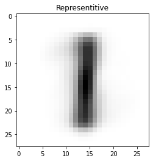


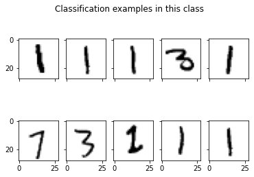


```python
plt.subplot()
plt.imshow(min_label[4,:].reshape(28,28),cmap='binary')
plt.title('Representitive')

data_atnum = data_train[np.where(min_cluster == 4)]

fig, axs = plt.subplots(2, 5)
(ax1, ax2, ax3, ax4, ax5), (ax6, ax7, ax8, ax9, ax10) = axs
fig.suptitle('Classification examples in this class')
ax1.imshow(data_atnum[0,:].reshape(28,28),cmap='binary')
ax2.imshow(data_atnum[1,:].reshape(28,28),cmap='binary')
ax3.imshow(data_atnum[2,:].reshape(28,28),cmap='binary')
ax4.imshow(data_atnum[3,:].reshape(28,28),cmap='binary')
ax5.imshow(data_atnum[4,:].reshape(28,28),cmap='binary')
ax6.imshow(data_atnum[5,:].reshape(28,28),cmap='binary')
ax7.imshow(data_atnum[6,:].reshape(28,28),cmap='binary')
ax8.imshow(data_atnum[7,:].reshape(28,28),cmap='binary')
ax9.imshow(data_atnum[8,:].reshape(28,28),cmap='binary')
ax10.imshow(data_atnum[1,:].reshape(28,28),cmap='binary')

for ax in axs.flat:
    ax.label_outer()
```


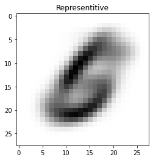


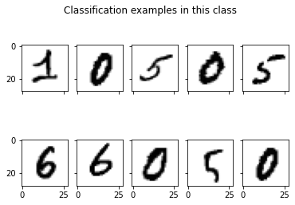


#### Mximum J_clust


```python
plt.subplot()
plt.imshow(max_label[1,:].reshape(28,28),cmap='binary')
plt.title('Representitive')

data_atnum = data_train[np.where(max_cluster == 1)]

fig, axs = plt.subplots(2, 5)
(ax1, ax2, ax3, ax4, ax5), (ax6, ax7, ax8, ax9, ax10) = axs
fig.suptitle('Classification examples in this class')
ax1.imshow(data_atnum[0,:].reshape(28,28),cmap='binary')
ax2.imshow(data_atnum[1,:].reshape(28,28),cmap='binary')
ax3.imshow(data_atnum[2,:].reshape(28,28),cmap='binary')
ax4.imshow(data_atnum[3,:].reshape(28,28),cmap='binary')
ax5.imshow(data_atnum[4,:].reshape(28,28),cmap='binary')
ax6.imshow(data_atnum[5,:].reshape(28,28),cmap='binary')
ax7.imshow(data_atnum[6,:].reshape(28,28),cmap='binary')
ax8.imshow(data_atnum[7,:].reshape(28,28),cmap='binary')
ax9.imshow(data_atnum[8,:].reshape(28,28),cmap='binary')
ax10.imshow(data_atnum[1,:].reshape(28,28),cmap='binary')

for ax in axs.flat:
    ax.label_outer()
```


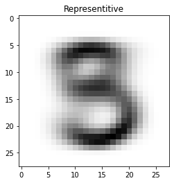


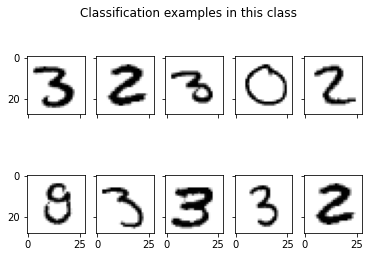


```python
plt.subplot()
plt.imshow(max_label[4,:].reshape(28,28),cmap='binary')
plt.title('Representitive')

data_atnum = data_train[np.where(max_cluster == 4)]

fig, axs = plt.subplots(2, 5)
(ax1, ax2, ax3, ax4, ax5), (ax6, ax7, ax8, ax9, ax10) = axs
fig.suptitle('Classification examples in this class')
ax1.imshow(data_atnum[0,:].reshape(28,28),cmap='binary')
ax2.imshow(data_atnum[1,:].reshape(28,28),cmap='binary')
ax3.imshow(data_atnum[2,:].reshape(28,28),cmap='binary')
ax4.imshow(data_atnum[3,:].reshape(28,28),cmap='binary')
ax5.imshow(data_atnum[4,:].reshape(28,28),cmap='binary')
ax6.imshow(data_atnum[5,:].reshape(28,28),cmap='binary')
ax7.imshow(data_atnum[6,:].reshape(28,28),cmap='binary')
ax8.imshow(data_atnum[7,:].reshape(28,28),cmap='binary')
ax9.imshow(data_atnum[8,:].reshape(28,28),cmap='binary')
ax10.imshow(data_atnum[1,:].reshape(28,28),cmap='binary')

for ax in axs.flat:
    ax.label_outer()
```


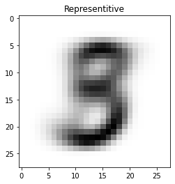


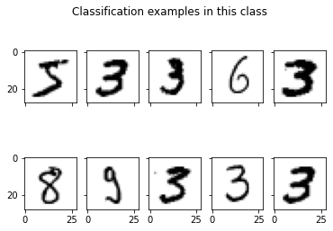


Generally, K=10 P=20 shows less accurate classification than K=20 P=30. 
