# 5, Experiment on K=10, P=20


```python
import pandas as pd
import numpy as np
import matplotlib.pyplot as plt
import scipy
from scipy.io import loadmat
import math
import random
```


```python
X = loadmat("mnist.mat")
print(X)

data_train = X['trainX'] # Training set digits 

print(data_train.shape)
```

    {'__header__': b'MATLAB 5.0 MAT-file Platform: posix, Created on: Wed Oct 18 19:00:09 2017', '__version__': '1.0', '__globals__': [], 'testX': array([[0, 0, 0, ..., 0, 0, 0],
           [0, 0, 0, ..., 0, 0, 0],
           [0, 0, 0, ..., 0, 0, 0],
           ...,
           [0, 0, 0, ..., 0, 0, 0],
           [0, 0, 0, ..., 0, 0, 0],
           [0, 0, 0, ..., 0, 0, 0]], dtype=uint8), 'testY': array([[7, 2, 1, ..., 4, 5, 6]], dtype=uint8), 'trainY': array([[5, 0, 4, ..., 5, 6, 8]], dtype=uint8), 'trainX': array([[0, 0, 0, ..., 0, 0, 0],
           [0, 0, 0, ..., 0, 0, 0],
           [0, 0, 0, ..., 0, 0, 0],
           ...,
           [0, 0, 0, ..., 0, 0, 0],
           [0, 0, 0, ..., 0, 0, 0],
           [0, 0, 0, ..., 0, 0, 0]], dtype=uint8)}
    (60000, 784)


```python
def initiation(K,data):
 
    n = int(len(data)/K)
    
    cluster_num = np.repeat(np.arange(K),n)
    np.random.shuffle(cluster_num)
    return cluster_num
```


```python
def get_label(cluster_num,K,data):
    label = np.zeros((K,len(data[0])))
    for i in range(K):
        cluster = data[np.where(cluster_num==i)]
        label[i,:] = np.mean(cluster,axis = 0)
    return label # return a list of label
```


```python
def new_cluster(K,label,data):
    # new_cluster_num = old_cluster
    data_norms = np.zeros((len(data),K)) 
    
    for i in range(K):
        dists = np.linalg.norm(data-label[i], axis = 1)
        data_norms[:,i] = dists
        
    new_cluster_num = np.argmin(data_norms, axis = 1)
    
    '''for i in range(len(data)):
        min_dist = 10000
        for j in range(K):
            if np.linalg.norm(data[i]-label[j])<min_dist:
                min_dist = np.linalg.norm(data[i]-label[j])
                new_cluster_num[i] = j'''
    return new_cluster_num
```


```python
def k_mean(K,data):
    cluster_num = initiation(K,data)
    label = get_label(cluster_num,K,data)
    count = 0
    J_clust = []
    while count<25:
        cluster_num = new_cluster(K,label,data)
        label = get_label(cluster_num,K,data)
        count += 1
        
        print('%d th iteration' % count) 
        
        means = np.linalg.norm(data-label[cluster_num])
        J = np.sum(means)
        
        '''for i in range(len(data)):
            class_num = int(cluster_num[i])
            J += (np.linalg.norm(data[i]-label[class_num]))**2'''
        J = J/len(data)
        J_clust.append(J)
    return cluster_num, label, J_clust
```


```python
def k_mean_Pruns(K,data,P):
    J_clust_all = np.zeros((P,25))
    label_all = np.zeros((P,K,len(data[0])))
    cluster_all = np.zeros((P,len(data)))
    for i in range(P):
        cluster_num, label, J_clust = k_mean(K,data)
        J_clust_all[i,:] = J_clust
        label_all[i,:,:] = label
        cluster_all[i,:] = cluster_num
    min_J_i = np.argmin(J_clust_all[:,-1])
    max_J_i = np.argmax(J_clust_all[:,-1])
    min_J = J_clust_all[min_J_i]
    max_J = J_clust_all[max_J_i]
    min_label = label_all[min_J_i]
    max_label = label_all[max_J_i]
    min_cluster = cluster_all[min_J_i]
    max_cluster = cluster_all[max_J_i]
    return min_J, min_label, min_cluster, max_J, max_label, max_cluster
```


```python
min_J, min_label, min_cluster, max_J, max_label, max_cluster = k_mean_Pruns(5,data_train,10)
```

## 5.1 Plotting J_clust


```python
x = np.arange(25)+1
plt.plot(x, min_J)
plt.plot(x, max_J)
plt.title('J_clust for K=5, P=10')
plt.xlabel('Iteration')
plt.ylabel('J_clust')
```


    Text(0, 0.5, 'J_clust')


    
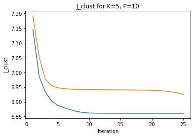
    


The minimum(blue) and maximum(orange) J_clust shows similar curve, but the curve for minimum J_clust is smoothier. They both drop very quickly before the first 5 iteration and flatten out at about 10 iterations. This suggests that the clustering is successful. The minimum J_clust flattens out at a smaller value than the maximum J_clust. The curve shape is very similar to that of K=20 P=30 and K=10 P=20, but has a larger J_clust value after the last iteration. Also, the gap between minimum J_clust and Maximum J_clust is larger than previous two experiments. This make sense since more classes and more repeated times are supposed to generate more accurate classification, which is showed in smaller J_clust.

## 5.2 Visualization of representitives


```python
plt.subplot(1, 5, 1)
plt.imshow(min_label[0,:].reshape(28,28),cmap='binary')
plt.subplot(1, 5, 2)
plt.imshow(min_label[1,:].reshape(28,28),cmap='binary')
plt.subplot(1, 5, 3)
plt.imshow(min_label[2,:].reshape(28,28),cmap='binary')
plt.title('Visualization for smallest J_clust')
plt.subplot(1, 5, 4)
plt.imshow(min_label[3,:].reshape(28,28),cmap='binary')
plt.subplot(1, 5, 5)
plt.imshow(min_label[4,:].reshape(28,28),cmap='binary')
```


    <matplotlib.image.AxesImage at 0x7f65ae7ef8e0>


    
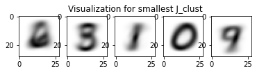
    


The representitives should be digits that represent all digits in that class. For minimum J_clust, they represents digits 6,3/5,1,0,9/7.


```python
plt.subplot(1, 5, 1)
plt.imshow(max_label[0,:].reshape(28,28),cmap='binary')
plt.subplot(1, 5, 2)
plt.imshow(max_label[1,:].reshape(28,28),cmap='binary')
plt.subplot(1, 5, 3)
plt.imshow(max_label[2,:].reshape(28,28),cmap='binary')
plt.title('Visualization for largest J_clust for K=5,P=10')
plt.subplot(1, 5, 4)
plt.imshow(max_label[3,:].reshape(28,28),cmap='binary')
plt.subplot(1, 5, 5)
plt.imshow(max_label[4,:].reshape(28,28),cmap='binary')
```


    <matplotlib.image.AxesImage at 0x7f65abedd910>


    
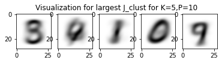
    


For minimum J_clust, they represents digits 3,4/9,1,0,7/9. Representitives for minimum J_clust shows clearer identification of digits than Representitives for maximum J_clust. Some of the representitives in maximum J_clust shows very blury image which are hard to identified which digit it represents. Also, representitives for maximum J_clust of some classes represents two digits, for example class 1 represents 4 and 9, and there're two represents 9 but none representes 5. Although the same trend also happens in representitives in minimum J_clust, but they are generally clearer and easier to identify.

Comparing to K=20 P=30 and K=10 P=20, each representitives shows blurier images and is harder to identify as digit. Also, more repetition and missing of digits occurs than previous two experiments. 


```python
def find_10smallest(data,cluster,label,num):
    data_atnum = data[np.where(cluster == num)]
    dists = np.linalg.norm(data_atnum-label[num], axis = 1)
    smallest_i = np.argpartition(dists,10)[:10]
    smallest_data = data_atnum[smallest_i]
    return smallest_data
```


```python
def draw_10smallest(data,cluster,label,num):
    smallest10_data = find_10smallest(data,cluster,label,num)
    fig, axs = plt.subplots(2, 5)
    (ax1, ax2, ax3, ax4, ax5), (ax6, ax7, ax8, ax9, ax10) = axs
    fig.suptitle('Visualization for smallest 10 for class %d' % num)
    ax1.imshow(smallest10_data[0,:].reshape(28,28),cmap='binary')
    ax2.imshow(smallest10_data[1,:].reshape(28,28),cmap='binary')
    ax3.imshow(smallest10_data[2,:].reshape(28,28),cmap='binary')
    ax4.imshow(smallest10_data[3,:].reshape(28,28),cmap='binary')
    ax5.imshow(smallest10_data[4,:].reshape(28,28),cmap='binary')
    ax6.imshow(smallest10_data[5,:].reshape(28,28),cmap='binary')
    ax7.imshow(smallest10_data[6,:].reshape(28,28),cmap='binary')
    ax8.imshow(smallest10_data[7,:].reshape(28,28),cmap='binary')
    ax9.imshow(smallest10_data[8,:].reshape(28,28),cmap='binary')
    ax10.imshow(smallest10_data[9,:].reshape(28,28),cmap='binary')

    for ax in axs.flat:
        ax.label_outer()
```

## 5.3 Identification of Classified/Misclassified

### 5.3.1 Identification for minimum J_clust


```python
draw_10smallest(data_train, min_cluster, min_label, 0)
```


    
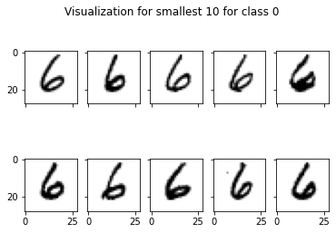
    


We can see that class 0 represents number 6.   
Digits: 6,6,6,6,6,6,6,6,6,6  
Number of classified: 10  
Number of misclassified: 0  


```python
draw_10smallest(data_train, min_cluster, min_label, 1)
```


    
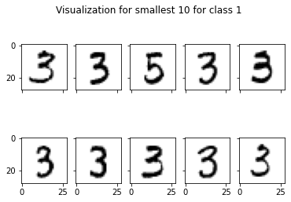
    


We can see that class 1 represents number 3 and 5   
Digits: 3,3,5,3,3,3,3,3,3,3  
Number of classified: 10  
Number of misclassified: 0  


```python
draw_10smallest(data_train, min_cluster, min_label, 2)
```


    
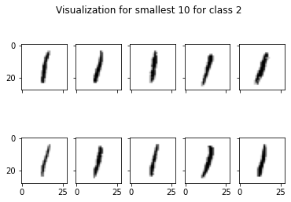
    


We can see that class 2 represents number 1.   
Digits: 1,1,1,1,1,1,1,1,1,1  
Number of classified: 10  
Number of misclassified: 0 


```python
draw_10smallest(data_train, min_cluster, min_label, 3)
```


    
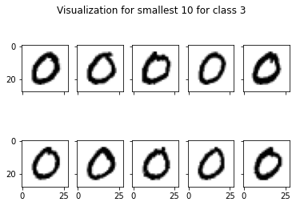
    


We can see that class 3 represents number 0.   
Digits: 0,0,0,0,0,0,0,0,0,0  
Number of classified: 10  
Number of misclassified: 0 


```python
draw_10smallest(data_train, min_cluster, min_label, 4)
```


    
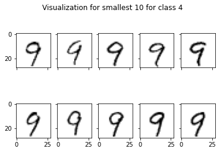
    


We can see that class 4 represents number 9 and 7.   
Digits: 9,9,9,9,9,9,9,9,9,9  
Number of classified: 10  
Number of misclassified: 0 

### 5.3.2 Identification for maximum J_clust


```python
draw_10smallest(data_train, max_cluster, max_label, 0)
```


    
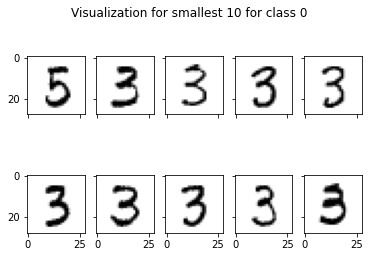
    


We can see that class 0 represents number 3 and 5   
Digits: 5,3,3,3,3,3,3,3,3,3  
Number of classified: 10  
Number of misclassified: 0 


```python
draw_10smallest(data_train, max_cluster, max_label, 1)
```


    
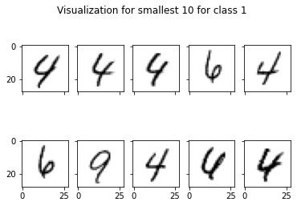
    


We can see that class 1 represents number 4 and 6   
Digits: 4,4,4,6,4,6,9,4,4,4  
Number of classified: 9  
Number of misclassified: 1


```python
draw_10smallest(data_train, max_cluster, max_label, 2)
```


    
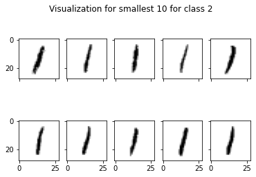
    


We can see that class 2 represents number 1.   
Digits: 1,1,1,1,1,1,1,1,1,1  
Number of classified: 10  
Number of misclassified: 0


```python
draw_10smallest(data_train, max_cluster, max_label, 3)
```


    
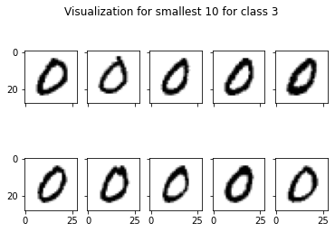
    


We can see that class 3 represents number 0.  
Digits: 0,0,0,0,0,0,0,0,0,0  
Number of classified: 10  
Number of misclassified: 0


```python
draw_10smallest(data_train, max_cluster, max_label, 4)
```


    
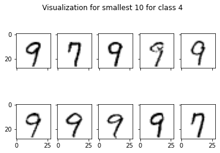
    


We can see that class 4 represents number 9 and 7   
Digits: 9,7,9,9,9,9,9,9,9,7  
Number of classified: 10  
Number of misclassified: 0

### 5.3.3 Tables of classified/misclassified

Following is the table for minimum J_clust.


```python
min_identify = {'Classified': [10,10,10,10,10],
        'Misclassified': [0,0,0,0,0] }
table_min = pd.DataFrame(min_identify, columns = ['Classified', 'Misclassified'])
table_min
```


<div>
<style scoped>
    .dataframe tbody tr th:only-of-type {
        vertical-align: middle;
    }

    .dataframe tbody tr th {
        vertical-align: top;
    }

    .dataframe thead th {
        text-align: right;
    }
</style>
<table border="1" class="dataframe">
  <thead>
    <tr style="text-align: right;">
      <th></th>
      <th>Classified</th>
      <th>Misclassified</th>
    </tr>
  </thead>
  <tbody>
    <tr>
      <th>0</th>
      <td>10</td>
      <td>0</td>
    </tr>
    <tr>
      <th>1</th>
      <td>10</td>
      <td>0</td>
    </tr>
    <tr>
      <th>2</th>
      <td>10</td>
      <td>0</td>
    </tr>
    <tr>
      <th>3</th>
      <td>10</td>
      <td>0</td>
    </tr>
    <tr>
      <th>4</th>
      <td>10</td>
      <td>0</td>
    </tr>
  </tbody>
</table>
</div>


Following is the table for maximum J_clust.


```python
max_identify = {'Classified': [10,9,10,10,10],
        'Misclassified': [0,1,0,0,0] }
table_max = pd.DataFrame(max_identify, columns = ['Classified', 'Misclassified'])
table_max
```


<div>
<style scoped>
    .dataframe tbody tr th:only-of-type {
        vertical-align: middle;
    }

    .dataframe tbody tr th {
        vertical-align: top;
    }

    .dataframe thead th {
        text-align: right;
    }
</style>
<table border="1" class="dataframe">
  <thead>
    <tr style="text-align: right;">
      <th></th>
      <th>Classified</th>
      <th>Misclassified</th>
    </tr>
  </thead>
  <tbody>
    <tr>
      <th>0</th>
      <td>10</td>
      <td>0</td>
    </tr>
    <tr>
      <th>1</th>
      <td>9</td>
      <td>1</td>
    </tr>
    <tr>
      <th>2</th>
      <td>10</td>
      <td>0</td>
    </tr>
    <tr>
      <th>3</th>
      <td>10</td>
      <td>0</td>
    </tr>
    <tr>
      <th>4</th>
      <td>10</td>
      <td>0</td>
    </tr>
  </tbody>
</table>
</div>


Observation shows that maximum J_clust has a greater number of misclassified than minimum J_clust. As J_clust represents distance from each data to the representitives, smaller J_clust means better classification of each digit, which is consistent with the observation.

### 4.3.4 Example visualization of misclassifed and classified in some class

#### Minimum J_clust


```python
plt.subplot()
plt.imshow(min_label[1,:].reshape(28,28),cmap='binary')
plt.title('Representitive')

data_atnum = data_train[np.where(min_cluster == 1)]

fig, axs = plt.subplots(2, 5)
(ax1, ax2, ax3, ax4, ax5), (ax6, ax7, ax8, ax9, ax10) = axs
fig.suptitle('Classification examples in this class')
ax1.imshow(data_atnum[0,:].reshape(28,28),cmap='binary')
ax2.imshow(data_atnum[1,:].reshape(28,28),cmap='binary')
ax3.imshow(data_atnum[2,:].reshape(28,28),cmap='binary')
ax4.imshow(data_atnum[3,:].reshape(28,28),cmap='binary')
ax5.imshow(data_atnum[4,:].reshape(28,28),cmap='binary')
ax6.imshow(data_atnum[5,:].reshape(28,28),cmap='binary')
ax7.imshow(data_atnum[6,:].reshape(28,28),cmap='binary')
ax8.imshow(data_atnum[7,:].reshape(28,28),cmap='binary')
ax9.imshow(data_atnum[8,:].reshape(28,28),cmap='binary')
ax10.imshow(data_atnum[1,:].reshape(28,28),cmap='binary')

for ax in axs.flat:
    ax.label_outer()
```


    
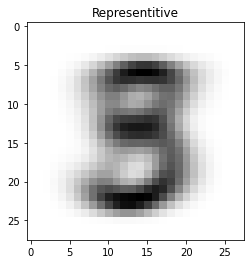
    


    
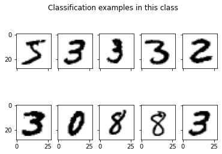
    


```python
plt.subplot()
plt.imshow(min_label[4,:].reshape(28,28),cmap='binary')
plt.title('Representitive')

data_atnum = data_train[np.where(min_cluster == 4)]

fig, axs = plt.subplots(2, 5)
(ax1, ax2, ax3, ax4, ax5), (ax6, ax7, ax8, ax9, ax10) = axs
fig.suptitle('Classification examples in this class')
ax1.imshow(data_atnum[0,:].reshape(28,28),cmap='binary')
ax2.imshow(data_atnum[1,:].reshape(28,28),cmap='binary')
ax3.imshow(data_atnum[2,:].reshape(28,28),cmap='binary')
ax4.imshow(data_atnum[3,:].reshape(28,28),cmap='binary')
ax5.imshow(data_atnum[4,:].reshape(28,28),cmap='binary')
ax6.imshow(data_atnum[5,:].reshape(28,28),cmap='binary')
ax7.imshow(data_atnum[6,:].reshape(28,28),cmap='binary')
ax8.imshow(data_atnum[7,:].reshape(28,28),cmap='binary')
ax9.imshow(data_atnum[8,:].reshape(28,28),cmap='binary')
ax10.imshow(data_atnum[1,:].reshape(28,28),cmap='binary')

for ax in axs.flat:
    ax.label_outer()
```


    
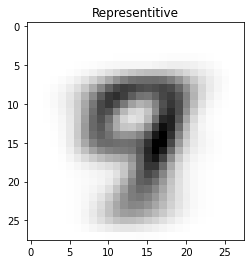
    


    
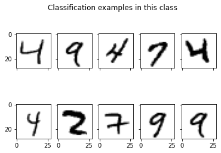
    


#### Maximum J_clust


```python
plt.subplot()
plt.imshow(max_label[1,:].reshape(28,28),cmap='binary')
plt.title('Representitive')

data_atnum = data_train[np.where(max_cluster == 1)]

fig, axs = plt.subplots(2, 5)
(ax1, ax2, ax3, ax4, ax5), (ax6, ax7, ax8, ax9, ax10) = axs
fig.suptitle('Classification examples in this class')
ax1.imshow(data_atnum[0,:].reshape(28,28),cmap='binary')
ax2.imshow(data_atnum[1,:].reshape(28,28),cmap='binary')
ax3.imshow(data_atnum[2,:].reshape(28,28),cmap='binary')
ax4.imshow(data_atnum[3,:].reshape(28,28),cmap='binary')
ax5.imshow(data_atnum[4,:].reshape(28,28),cmap='binary')
ax6.imshow(data_atnum[5,:].reshape(28,28),cmap='binary')
ax7.imshow(data_atnum[6,:].reshape(28,28),cmap='binary')
ax8.imshow(data_atnum[7,:].reshape(28,28),cmap='binary')
ax9.imshow(data_atnum[8,:].reshape(28,28),cmap='binary')
ax10.imshow(data_atnum[1,:].reshape(28,28),cmap='binary')

for ax in axs.flat:
    ax.label_outer()
```


    
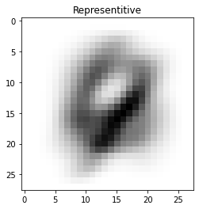
    


    
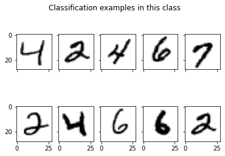
    


```python
plt.subplot()
plt.imshow(max_label[4,:].reshape(28,28),cmap='binary')
plt.title('Representitive')

data_atnum = data_train[np.where(max_cluster == 4)]

fig, axs = plt.subplots(2, 5)
(ax1, ax2, ax3, ax4, ax5), (ax6, ax7, ax8, ax9, ax10) = axs
fig.suptitle('Classification examples in this class')
ax1.imshow(data_atnum[0,:].reshape(28,28),cmap='binary')
ax2.imshow(data_atnum[1,:].reshape(28,28),cmap='binary')
ax3.imshow(data_atnum[2,:].reshape(28,28),cmap='binary')
ax4.imshow(data_atnum[3,:].reshape(28,28),cmap='binary')
ax5.imshow(data_atnum[4,:].reshape(28,28),cmap='binary')
ax6.imshow(data_atnum[5,:].reshape(28,28),cmap='binary')
ax7.imshow(data_atnum[6,:].reshape(28,28),cmap='binary')
ax8.imshow(data_atnum[7,:].reshape(28,28),cmap='binary')
ax9.imshow(data_atnum[8,:].reshape(28,28),cmap='binary')
ax10.imshow(data_atnum[1,:].reshape(28,28),cmap='binary')

for ax in axs.flat:
    ax.label_outer()
```


    
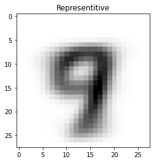
    


    
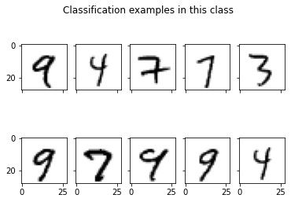
    


Generally, K=10 P=20 shows less accurate classification than K=20 P=30 and K=10 P=20. So classification into more classes and larger repetition times generate more accurate clustering.

# 6, Comparison between supervised and unsupervised learning

Least square classifier gives more accurate results than k-means clustering. As we can see from examples visualization at the end of each session, a significant amount of the digits are misclassified in k-means clustering. Even the 10 nearest digits shows some misclassifications, while both the least square classifiers have an decent error rate below 15%.

However, when unsupervised learning gives less accurate results, it's useful when no labels is known. It can find the hidden patterns for some unknown dataset and is more close to the true Artificial Intelligence. 
